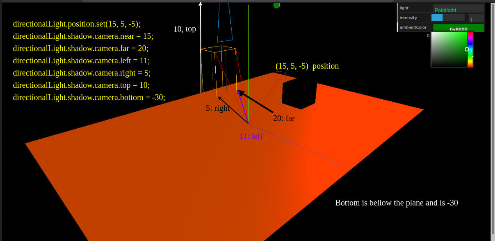
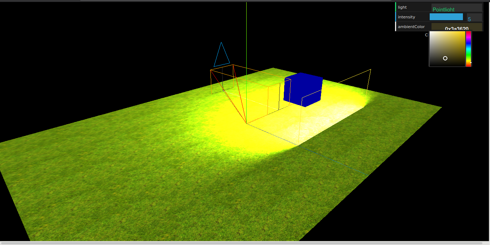

# Light

---

Available lights in threejs

| Name                     | Description                                                                                                                                                                                                                   |
| ------------------------ | ----------------------------------------------------------------------------------------------------------------------------------------------------------------------------------------------------------------------------- |
| `THREE.AmbientLight `    | This is a basic light, the color of which is added to the current color of the objects in the scene.                                                                                                                          |
| `THREE.PointLight`       | This is a single point in space from which light spreads in all directions. This light can't be used to create shadows.                                                                                                       |
| `THREE.SpotLight `       | This light source has a cone-like effect like that of a desk lamp, a spot in the ceiling, or a torch. This light can cast shadows.                                                                                            |
| `THREE.DirectionalLight` | This is also called infinite light. The light rays from this light can be seen as parallel, like, for instance, the light from the sun. This light can also be used to create shadows.                                        |
| ` THREE.HemisphereLight` | This is a special light and can be used to create more natural-looking outdoors lighting by simulating a reflective surface and a faintly illuminating sky. This light also doesn't provide any shadow-related functionality. |
| `THREE.AreaLight `       | With this light source, instead of a single point in space, you can specify an area from which light emanates. THREE.AreaLight doesn't cast any shadows.                                                                      |
| ` THREE.LensFlare`       | This is not a light source, but with THREE.LensFlare, you can add a lens flare effect to the lights in your scene.                                                                                                            |

## Basic lights

## `THREE.AmbientLight`

When you create THREE.AmbientLight, the color is applied globally. There isn't a specific direction this light comes from, and `THREE.AmbientLight` doesn't contribute to any shadows. The standard color we set in the code for this scene is `#606008`.

- It comes fron no specific direction.
- It does not cast any shadows
- It colors all the objects the same color no matter the shape.
- You use it together with other lighting sources, such as `THREE.SpotLight` or `THREE.DirectionalLight`, to soften the shadows or add some additional color to the scene

### How to create a `THREE.AmbientLight`

```js
let ambientLight = new THREE.AmbientLight("#606008");
scene.add(ambientLiht);
```

### How to connect `THREE.AmbientLight` to the GUI Controls menu

```javascript
let ambientLight = THREE.ambientLight();
let gui = new dat.GUI();
let control = new (function () {
  this.ambientColor = ambientLight.color.getStyle();
})();

/**
 * instead of using the gui.add(...) function, we use the gui.addColor(...) function to control the color. This creates an option in the Controls menu, with which we can directly change the color of the passed-in variable
 */
gui.addColor(control, "ambientColor").onChange(() => {
  ambientLight.color = new Color(control.ambientColor);
});
```

## `THREE.SpotLight`

### Properties of spotlight

| Property   | Description                                                                                                                                                                                                                                                                  |
| ---------- | ---------------------------------------------------------------------------------------------------------------------------------------------------------------------------------------------------------------------------------------------------------------------------- |
| angle      | This determines how wide the beam emerging from this light is. This is measured in radians <br /> <br /> defaults to `Math.PI`/3.                                                                                                                                            |
| castShadow | If set to true, this light will create shadows. See the following table on how to configure the shadows.                                                                                                                                                                     |
| color      | This is the color of the light.                                                                                                                                                                                                                                              |
| decay      | This is the amount the intensity diminishes the farther away from the light source it gets. A decay of 2 leads to more realistic light, and **the default value is 1**. This property only has effect when the physicallyCorrectLights property is set on the WebGLRenderer. |
| distance   | When this property is set to a non 0 value, the light intensity will decrease linearly from the set intensity at the light's position to 0 at this distance.                                                                                                                 |
| intensity  | This is the intensity the light shines with.**This defaults to 1**.                                                                                                                                                                                                          |
| penumbra   | The percentage at the edge of the spotlight's coin, which is smoothed (blurred) to 0. Takes a value between 0 and 1, and the **default is 0**.                                                                                                                               |
| position   | This is the position of the light in THREE.Scene.                                                                                                                                                                                                                            |
| power      | The light's power when being rendered in physical correct mode (enable this by setting the physicallyCorrectLights property set on the WebGLRenderer). This is measured in lumens and the **default value is 4\*Math**.PI.                                                   |
| target     | With THREE.SpotLight, the direction it is pointed in is important. With the target property, you can point THREE.SpotLight to look at a specific object or position in the scene. Note that this property requires a THREE.Object3D object (such as THREE.Mesh).             |
| visible    | If this is set to true (the default), this light is turned on, and if this is set to false, the light is turned off.                                                                                                                                                         |

### Shadow properties of spotlight

| Property                                         | Description                                                                                                                                                                                                                                                                    |
| ------------------------------------------------ | ------------------------------------------------------------------------------------------------------------------------------------------------------------------------------------------------------------------------------------------------------------------------------ |
| shadow.bias                                      | The shadow bias moves the cast shadow away or toward the object casting the shadow. . If you see strange shadow effects, small values (for example, 0.01) for this property can often resolve the issue. **_The default value for this property is 0._**                       |
| shadow.camera.far                                | This determines what distance from the light shadows should be created. **The default value is 5000**. Note that you can also set all the other properties provided for THREE.PerspectiveCamera, which we showed in Chapter 2, Basic Components That Make Up a Three.js Scene. |
| shadow.camera.fov                                | This determines how large the field of view used to create shadows is (see the Different cameras for different uses section in Chapter 2, Basic Components That Make Up a Three.js Scene). **The default value is 50**.                                                        |
| shadow.camera.near                               | This determines what distance from the light shadows should be created. **The default value is 50**.                                                                                                                                                                           |
| shadow.mapSize.width and   shadow.mapSize.height | This determines how many pixels are used to create the shadow. Increase this when the shadow has jagged edges or doesn't look smooth. This can't be changed after the scene is rendered. **The default value for both is 512**.                                                |
| shadow.radius                                    | When this value is set to values higher than 1, the edge of the shadows will be blurred. This won't have any effect if the shadowMap.type of the THREE.WebGlRenderer is set to THREE.BasicShadowMap.                                                                           |

### How to create a `THREE.spotLight`

```javascript
let spotLight = new THREE.SpotLight("#ffffff");
spotLight.position.set(-40, 60, -10);
spotLight.castShadow = true;
spotLight.shadow.camera.near = 1;
spotLight.shadow.camera.far = 100;
spotLight.target = plane;
spotLight.distance = 0;
spotLight.angle = 0.4;
spotLight.shadow.camera.fov = 120;
```

With shadow.camera.near, shadow.camera.far, and shadow.camera.fov, you can control how and where this light casts a shadow.

## **Debuging**

Debuging issues in

- shadows
  The use of `THREE.cameraHelper` is essential.

  ```javascript
  let debugCamera = new THREE.CameraHelper(spotLight.shadow.camera);
  scene.add(debugCamera);
  ```

- `THREE.spotLight`

  ```javascript
  let helper = new THREE.SpotLightHelper(spotLight);
  scene.add(helper);

  function render() {
  ...
  helper.update();
  ...
  }
  ```

  > This works if the spotlight is looking at a vector point not an object.

## `THREE.pointLight`

### How to create a `THREE.PointLight`

```javascript
let pointLight = new PointLight("red");
pointLight.distance = 100;
pointLight.castShadow = true;
pointLight.position.set(20, 10, 10);
pointLight.lookAt(20, 10, 10);
```

### Properties of pointlight

| Property  | Description                                                                                                                                                                                                                                                                                                      |
| --------- | ---------------------------------------------------------------------------------------------------------------------------------------------------------------------------------------------------------------------------------------------------------------------------------------------------------------- |
| color     | This is the color of the light.                                                                                                                                                                                                                                                                                  |
| distance  | This is the distance for which the light shines. The default value is 0, which means that the light's intensity doesn't decrease based on distance.                                                                                                                                                              |
| intensity | This is the intensity the light shines with. This defaults to 1.                                                                                                                                                                                                                                                 |
| position  | This is the position of the light in THREE.Scene.                                                                                                                                                                                                                                                                |
| visible   | If this property is set to true (the default), this light is turned on, and if set it to false, the light is turned off.                                                                                                                                                                                         |
| decay     | This is the amount the intensity diminishes the farther away from the light source it gets. A decay of 2 leads to more realistic light, and the default value is 1. This property only has effect when the physicallyCorrectLights property is set on the WebGLRenderer.                                         |
| power     | This is the light's power when being rendered in physically correct mode (enable this by setting the physicallyCorrectLights property set on the WebGLRenderer). This is measured in lumens and the default value is 4*Math.PI. And is also directly related to the intensity property (power = intensity * 4π). |

## `THREE.DirectionalLight`

> The common use case for this is to simulate daylight
>
> A common point of confusion for directional lights is that setting the rotation has no effect. This is because three.js's DirectionalLight is the equivalent to what is often called a 'Target Direct Light' in other applications.



## Difference between `THREE.spotLight` and `THREE.DirectionalLight`

- Directional light won't diminish the farther it gets from the target of THREE.DirectionalLight as it does with THREE.SpotLight

### How to create a `THREE.DirectionalLight`

```javascript
let directionalLight = new DirectionalLight("red", 5);
directionalLight.position.set(0, 0, 0);
directionalLight.castShadow = true;
directionalLight.shadow.camera.near = 15;
directionalLight.shadow.camera.far = 0;
directionalLight.shadow.camera.left = 11;
directionalLight.shadow.camera.right = 5;
directionalLight.shadow.camera.top = 10;
directionalLight.shadow.camera.bottom = -30;
```

## Special lights

- `THREE.HemisphereLight`
- `THREE.AreaLight`

## `THREE.HemisphereLight`

we can create more natural-looking outdoor lighting. A light source positioned directly above the scene, with color fading from the sky color to the ground color. Without this light, we could simulate the outdoors by creating `THREE.DirectionalLight`, which emulates the sun, and maybe add an additional `THREE.AmbientLight` to provide some general color to the scene.

### How to create a !THREE.HemisphereLight` light;

```javascript
const light = new THREE.HemisphereLight(
  (skyColor: Integer),
  (groundColor: Integer),
  (intensity: Float)

  // skyColor - (optional) hexadecimal color of the sky. Default is 0xffffff.
  // groundColor - (optional) hexadecimal color of the ground. Default is 0xffffff.
  // intensity - (optional) numeric value of the light's strength/intensity. Default is 1.
);
const light = new THREE.HemisphereLight(0xffffbb, 0x080820, 1);
scene.add(light);
```

### Properties of THREE.HemisphereLight

| Property    | Description                                        |
| ----------- | -------------------------------------------------- |
| groundColor | This is the color that is emitted from the ground. |
| color       | This is the color that is emitted from the sky.    |
| intensity   | This is the intensity with which the light shines. |

## `THREE.AreaLight`

With THREE.AreaLight, we can define a rectangular area that emits light.

> Both MeshStandardMaterial and MeshPhysicalMaterial support area lights. The other materials do not.
>
> When you create THREE.AreaLight, it will be created as a **vertical** plane.
>
> You can't see the light source itself, only the light it emits.



### How to creat a `THREE.RectAreaLight`

```javascript
let rectAreaLight = THREE.RectAreaLight(color in hex, intensity, width, height);
let rectAreaLight = THREE.RectAreaLight(0xc9b827, 100, 50, 100);
rectAeraLight.position.set(10, 2, 10);
scene.add(rectAeraLight);

const rectLightHelper = new THREE.RectAreaLightHelper(rectLight);
rectLight.add(rectLightHelper);
scene.add(rectLightHelper);
```

<!-- ## Lens flare -->

## **NOTES**

1. > If the shadow looks blocky, you can either increase the shadow.mapSize.width and shadow.mapSize.Height properties and make sure the area that is used to calculate the shadow tightly wraps your object. You can use the shadow.camera.near, shadow.camera.far, and shadow.camera.fov properties to configure this area.

2. > Remember that you not only have to tell the light to cast shadows, but also have to tell each geometry whether it will receive and/or cast shadows by setting the castShadow and receiveShadow properties.

3. > If you use thin objects in your scene, you might see strange artifacts when you render shadows. You can use the shadow.bias property to slightly offset the shadows, which will often fix these kinds of issues.

4. > If you want to have softer shadows, you can set a different shadowMapType value on `THREE.WebGLRenderer`. By default, this property is set to `THREE.PCFShadowMap`; if you set this property to PCFSoftShadowMap, you get softer shadows.
